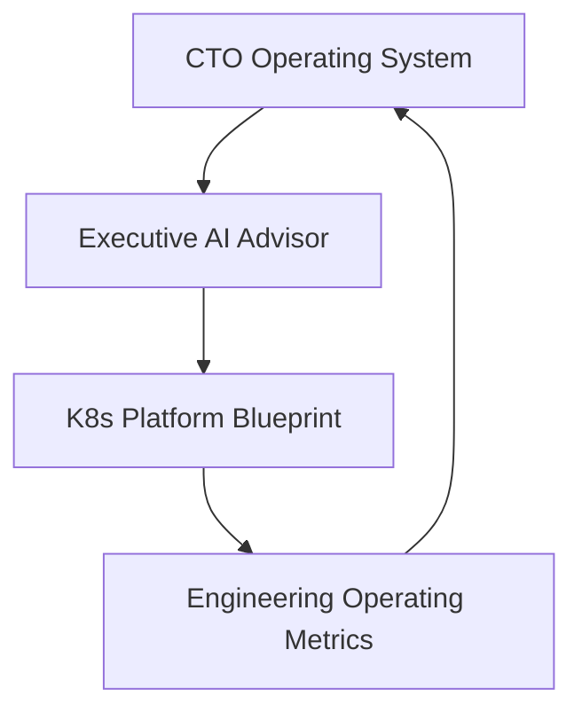

# Technology Leadership Portfolio

A practical system for assessing, operating, governing, implementing, and measuring technology organizations.

Most technology failures in growing companies are not isolated engineering failures. They are failures of visibility, governance, prioritization, execution, and measurement.

This portfolio demonstrates a practical approach to:

- Technology Due Diligence
- AI Governance
- Platform Governance
- Technology Modernization
- Board Reporting
- Operating Partner Support
- Engineering Effectiveness

The repositories below represent an integrated technology leadership system rather than a collection of unrelated tools.

All case studies are synthetic examples designed to demonstrate technology leadership patterns. They do not represent confidential client work.

## About This Portfolio

This repository is the front door for Timothy Serewicz's technology leadership portfolio. It connects methodology, assessment, implementation, and measurement across related projects focused on CTO leadership, technology diligence, AI governance, platform modernization, and engineering effectiveness.

## Portfolio Model

CTO Operating System defines methodology, governance frameworks, operating models, board reporting templates, and diligence processes.

Executive AI Advisor transforms company documents into technology due diligence reports, board briefs, AI governance assessments, CRA readiness assessments, and 100-day plans.

K8s Platform Blueprint provides implementation patterns for Kubernetes governance, FinOps, observability, policy controls, compliance evidence, and platform modernization.

Engineering Operating Metrics measures engineering effectiveness, review quality, delivery flow, rework, cost, risk, and governance outcomes.

## Portfolio Components

### CTO Operating System

**Repository:** [cto-operating-system](https://github.com/serewicz/cto-operating-system)

**Purpose:** Methodology

**Focus:**

- CTO operating model
- Technology due diligence
- Board reporting
- Governance frameworks
- AI governance
- Operating partner workflows

**Example outputs:**

- Board Technology Brief
- Governance Framework
- Due Diligence Checklist
- 100-Day Plan Framework

### Executive AI Advisor

**Repository:** [Executive-AI-Advisor](https://github.com/serewicz/Executive-AI-Advisor)

**Purpose:** Assessment and Planning

**Focus:**

- Technology Due Diligence
- AI Governance Assessment
- CRA Readiness
- Board Briefs
- Executive Reporting
- 100-Day Technology Plans

**Example outputs:**

- Technology Due Diligence Report
- Risk Heatmap
- CRA Readiness Assessment
- Board Summary
- 100-Day Technology Plan

### K8s Platform Blueprint

**Repository:** [k8s-platform-blueprint](https://github.com/serewicz/k8s-platform-blueprint)

**Purpose:** Implementation

**Focus:**

- Platform Governance
- FinOps
- Observability
- Policy-as-Code
- Compliance Evidence
- Kubernetes Operations
- Platform Modernization

**Example outputs:**

- Platform Governance Architecture
- FinOps Dashboard Design
- Policy Controls
- Platform Maturity Model
- Compliance Evidence Patterns

### Engineering Operating Metrics

**Repository:** [engineering-operating-metrics](https://github.com/serewicz/engineering-operating-metrics)

**Purpose:** Measurement

**Focus:**

- Delivery Flow
- Review Quality
- Rework
- Engineering Cost
- AI Usage Cost
- Technical Risk
- Engineering Governance

**Example outputs:**

- Engineering Health Dashboard
- Delivery Effectiveness Report
- Review Quality Scorecard
- Cost Trend Report
- Risk Hotspot Report

## Example Engagements

### Founder-Led SaaS Acquisition Target

**Case study:** [Founder-Led SaaS Acquisition Target](case-studies/founder-led-saas-acquisition-target.md)

**Summary:** A founder-led vertical SaaS company with manual deployments, founder dependency, incomplete documentation, informal security ownership, and acquisition integration risk.

**Outputs:**

- Technology Due Diligence Report
- Risk Heatmap
- Board Questions
- Acquisition Integration Plan
- Post-close Metrics Dashboard

### Growth Equity B2B SaaS

**Case study:** [Growth Equity B2B SaaS](case-studies/growth-equity-b2b-saas.md)

**Summary:** A B2B SaaS company experiencing rapid growth, rising cloud costs, technical debt, and increasing delivery complexity.

**Outputs:**

- Board Technology Brief
- Growth 100-Day Plan
- FinOps Review
- Delivery Dashboard
- AI Governance Assessment

### Regulated FinTech Platform

**Case study:** [Regulated FinTech Platform](case-studies/regulated-fintech-platform.md)

**Summary:** A software company facing compliance, AI governance, incident reporting, vendor concentration, privileged access, and CRA readiness challenges.

**Outputs:**

- CRA Readiness Assessment
- AI Governance Assessment
- Security Risk Review
- Governance Scorecard
- Board Discussion Points

## Why This Matters

Most technology problems in growing companies are not isolated engineering problems. They are failures of visibility, governance, prioritization, execution, and measurement.

This portfolio demonstrates how a technology executive can:

- assess technology risk
- translate technical findings into board-level language
- create operating plans
- implement governance patterns
- measure whether execution is improving

## Relevant For

- CTO roles
- Interim CTO work
- Fractional CTO work
- PE operating partner support
- Board advisory work
- Technology due diligence
- AI governance and risk reviews
- Platform modernization
- Engineering operating improvement

## About

Timothy Serewicz is a technology executive focused on helping founders, CEOs, investors, boards, and operating partners align technology decisions with business outcomes.

Areas of focus:

- Technology Strategy
- AI Governance
- Technology Due Diligence
- Platform Modernization
- Cloud and Kubernetes Governance
- Engineering Effectiveness
- Board and Executive Communication

## Roadmap

See [Portfolio Roadmap](docs/portfolio-roadmap.md).

## License

This portfolio is licensed under Creative Commons Attribution 4.0 International (CC BY 4.0), unless otherwise noted.

The repositories linked from this portfolio may use different licenses depending on whether they contain software, documentation, or templates.

## Contact

- Website: https://serewicz.com
- LinkedIn: https://www.linkedin.com/in/serewicz/
- GitHub: https://github.com/serewicz
